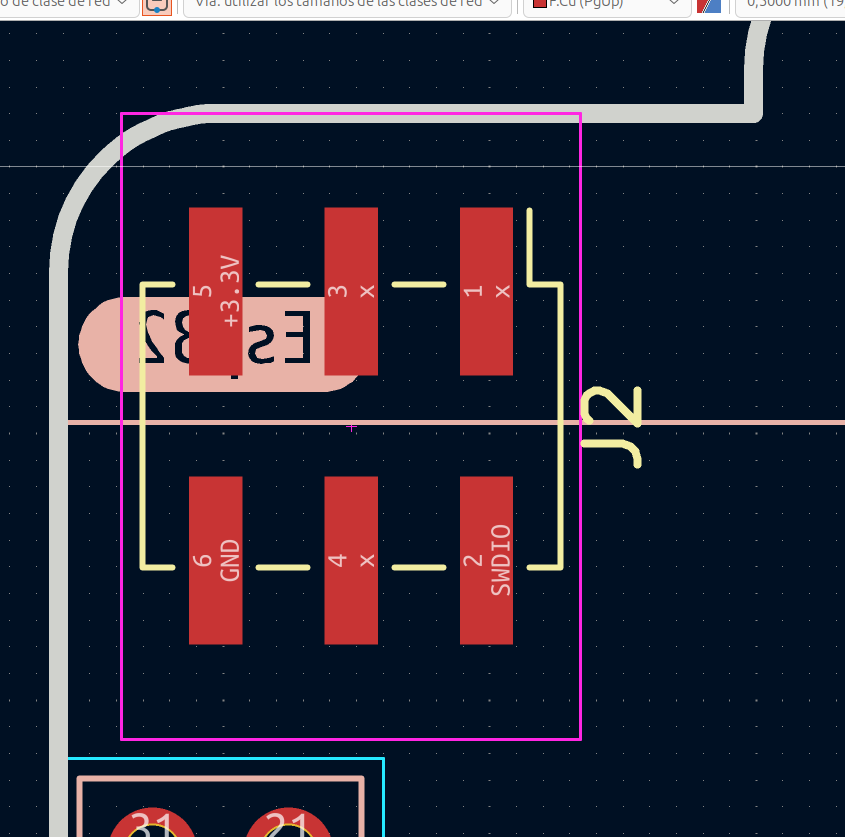
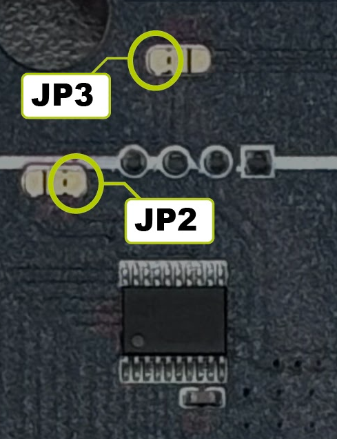
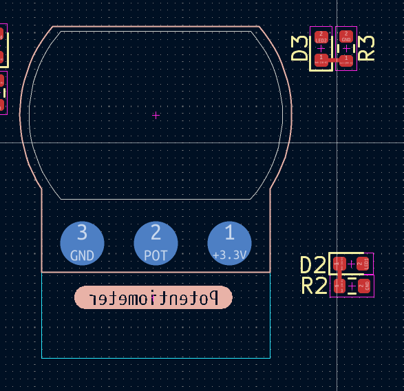
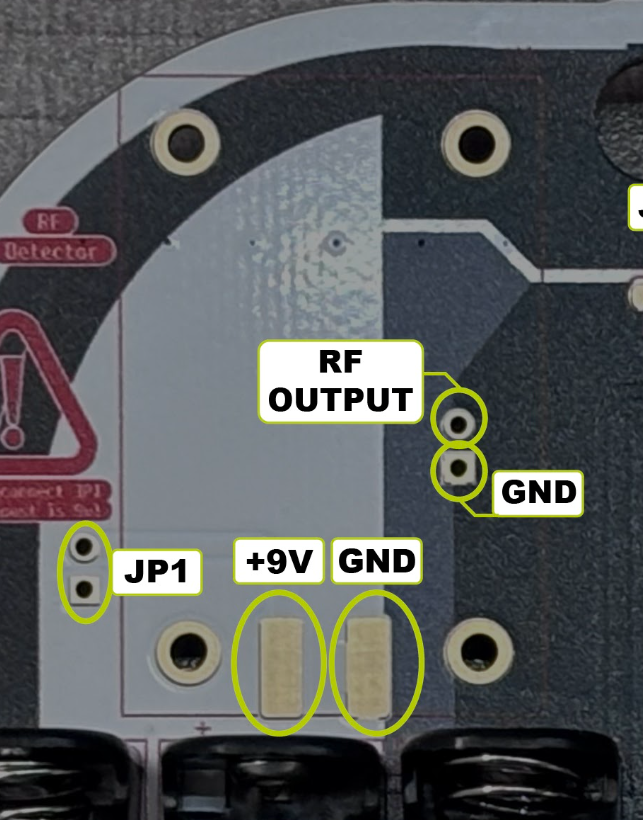

# Hardware config 

# Addon 

The Addon is located on the front side of the board, and the connections are as follows:

# Boost circuit
The Boost circuit must be placed on the rear side of the board, as shown in the image. It raises the voltage from 5 V to 9 V for the RF detector.

# I²C jumper 
The I²C jumpers are located on the rear side of the board (JP3 for SCL and JP2 for SDA). These determine whether the ESP32 or the CH32 will control the OLED display. By default, the CH32 controls the display. To change control, the pads must be cut to separate them.

# Potenciometer 
The potentiometer must be installed on the rear side of the board, ensuring that its notch fits into the corresponding slot, allowing the value to be adjusted from the front side of the PCB.

# RF Detector 
The RF detector must be placed on the rear side of the PCB, as shown in the image. IMPORTANT: Before soldering the RF module, first solder the Boost circuit and configure its voltage to 9 V to ensure proper operation of the RF detector and prevent damage. The PCB has the supply voltage (9VA) disconnected via JP1 to avoid damage. Only bridge it after confirming that the voltage is correct.

