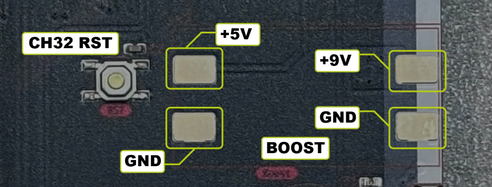
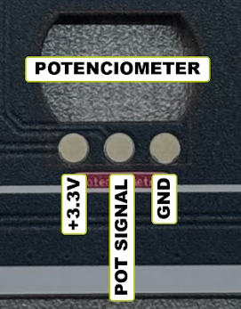

# Hardware config 

Attention! Reading this README is essential—not only for a better understanding and experience, but also to avoid damaging the badge.

The 44con can operate either with the ESP32 or with the shield. It is important to note that, for the badge to function correctly, at least one of the two must be soldered. Otherwise, the badge will not work.

When the shield is installed, the badge will only operate the OLED display with the built-in mini-game.

(Badge with shield)

# 
If you solder the shield you only need to solder the bended pins shown at the photo at least, if you decide to solder more pins just for fun go ahead.

#
For the best possible experience with the badge, it is recommended to solder the ESP32 with the following components:

ESP32 Wemos D1 module

Buzzer

MT3608 Boost Converter

AD8317 RF Detector

# Addon 

The Addon is located on the front side of the board, and the connections are as follows:

# Boost circuit
It raises the voltage from 5 V to 9 V for the RF detector. The Boost circuit must be placed on the rear side of the board, as shown in the image. 

 

# I²C jumper 
The I²C jumpers are located on the rear side of the board (JP3 for SCL and JP2 for SDA). These determine whether the ESP32 or the CH32 will control the OLED display. By default, the CH32 controls the display. To switch control to the ESP32, the pads must be cut to separate them (as indicated in the image), and then the central pad must be soldered to the opposite pad. In the case of JP2, solder the central pad to the left pad, and for JP3, solder it to the right pad.

# Potenciometer
The potentiometer must be installed on the rear side of the board, ensuring that its notch fits into the corresponding slot, allowing the value to be adjusted from the front side of the PCB. 

This is how it should look, front and back.

# Buzzer
For the buzzer, please solder it as follows:

# RF Detector 
It detects hidden wireless devices by measuring RF signal strength and displaying results on an OLED screen, with optional buzzer alerts.

The RF detector must be placed on the rear side of the PCB, as shown in the image. IMPORTANT: Before soldering the RF module, first solder the Boost circuit and configure its voltage to 9 V to ensure proper operation of the RF detector and prevent damage. The PCB has the supply voltage (9VA) disconnected via JP1 to avoid damage. Only bridge it after confirming that the voltage is correct.
For more information about the functionality, please refer to the following repository: https://github.com/RamboRogers/rfhunter

 

This project uses and builds upon the work of rfhunter by RamboRogers.

The original firmware and repository can be found here: https://github.com/RamboRogers/rfhunter

We acknowledge and thank the original author for making this project available!
